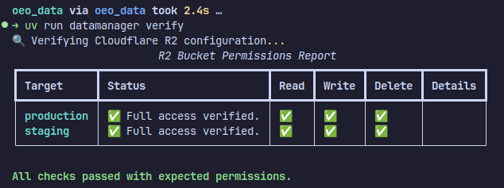
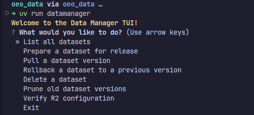

# OEO Data management

This repository provides a command-line tool (datamanager) to manage large, versioned datasets (like SQLite files) using Git for metadata and Cloudflare R2 for object storage.

This approach avoids the pitfalls of storing large binary files directly in Git (or the costs associated with Git LFS) while still providing a robust, auditable version history for your data assets.

## The Core Concept

The system works by treating your Git repository as a source of truth for *metadata*, not for the data itself. Large data files are stored in a cost-effective object store (Cloudflare R2), which has the major benefit of zero egress fees for open data projects.

The workflow is as follows:

```mermaid
flowchart TD
    subgraph "Local Machine / CI Runner"
        A[Developer] --> B{datamanager CLI};
        B --> C[Git Repo];
        C --> D[manifest.json];
        C --> E[.diff files];
    end

    subgraph "Cloud"
        F[Remote Git Repo <br/>(GitHub, GitLab)];
        G[Cloudflare R2 Bucket];
    end

    B -- "1. Uploads new .sqlite file" --> G;
    B -- "2. Calculates hash & diff" --> C;
    C -- "3. git push" --> F;

    style G fill:#f9f,stroke:#333,stroke-width:2px
    style F fill:#ccf,stroke:#333,stroke-width:2px
```

A `manifest.json` file in the Git repo acts as a "pointer" system, mapping dataset versions to specific, immutable objects in R2, complete with integrity hashes.

## Features

- **Transactional Operations:** Updates and creations are transactional. If an R2 upload or `git push` fails, the operation is automatically rolled back to prevent inconsistent states.
- **Interactive TUI:** Run `datamanager` with no arguments for a user-friendly, menu-driven interface.
- **CLI for Automation:** A full suite of commands for scripting and CI/CD integration.
- **Integrity Verification:** All downloaded files are automatically checked against their SHA256 hash from the manifest.
- **Small SQL Diffs:** For small changes, human-readable `.diff` files are stored directly in Git for quick review.
- **Credential Verification:** A simple `verify` command to check your R2 configuration.

## Prerequisites

- Python 3.12+
- Git
- `sqlite3` command-line tool
- An active Cloudflare account with an R2 bucket.
  - For the data in this repo, contact the OEO team for access to the R2 bucket.

## ⚙️ Setup and Installation

1. **Clone the Repository:**

    ```bash
    git clone git@github.com:ParticularlyPythonicBS/oeo_data.git
    cd oeo_data
    ```

2. **Install Dependencies:**
    This project uses and recommends `uv` for fast and reliable dependency management.

    ```bash
    uv sync
    uv pip install -e .
    ```

    The `-e` flag installs the package in "editable" mode, so changes to the source code are immediately reflected.

3. **Configure Environment Variables:**
    The tool is configured using a `.env` file. Create one by copying the example:

    ```bash
    cp .env.example .env
    ```

    Now, edit the `.env` file with your Cloudflare R2 credentials. **This file should be in your `.gitignore` and never committed to the repository.**

    **`.env`**

    ```ini
    # Get these from your Cloudflare R2 dashboard
    R2_ACCOUNT_ID="your_cloudflare_account_id"
    R2_ACCESS_KEY_ID="your_r2_access_key"
    R2_SECRET_ACCESS_KEY="your_r2_secret_key"
    R2_BUCKET="your-r2-bucket-name"
    ```

4. **Verify Configuration:**
    Run the `verify` command to ensure your credentials and bucket access are correct.

    ```bash
    datamanager verify
    ```

    

## 🚀 Usage

### Interactive TUI

For a guided experience, simply run the command with no arguments:

```bash
uv run datamanager
```

This will launch a menu where you can choose your desired action.



### Command-Line Interface (CLI)

#### `verify`

Checks R2 credentials and bucket access.

```bash
uv run datamanager verify
```


#### `list-datasets`

Lists all datasets currently tracked in `manifest.json`.

```bash
uv run datamanager list-datasets

```


#### `create`

Adds a new dataset to be tracked.

```bash
uv run datamanager create <dataset-name.sqlite> <path/to/local/file.sqlite>
```


#### `update`

Creates a new version of an existing dataset.

```bash
uv run datamanager update <dataset-name.sqlite> <path/to/new/file.sqlite>
```


#### `pull`

Downloads a dataset from R2 and verifies its integrity.

```bash
# Pull the latest version
uv run datamanager pull user-profiles.sqlite

# Pull a specific version
uv run datamanager pull user-profiles.sqlite --version v2

# Pull and save to a different path/name
uv run datamanager pull user-profiles.sqlite -o ./downloads/users_v2.sqlite
```


## 🧑‍💻 Development and Testing

To contribute to the tool's development:

1. Install development dependencies (if any are added to `pyproject.toml`).
2. Run the test suite using `pytest`:

    ```bash
    uv run pytest
    ```

3. For code quality checks, run:

    ```bash
    uv pre-commit run --all-files
    ```
