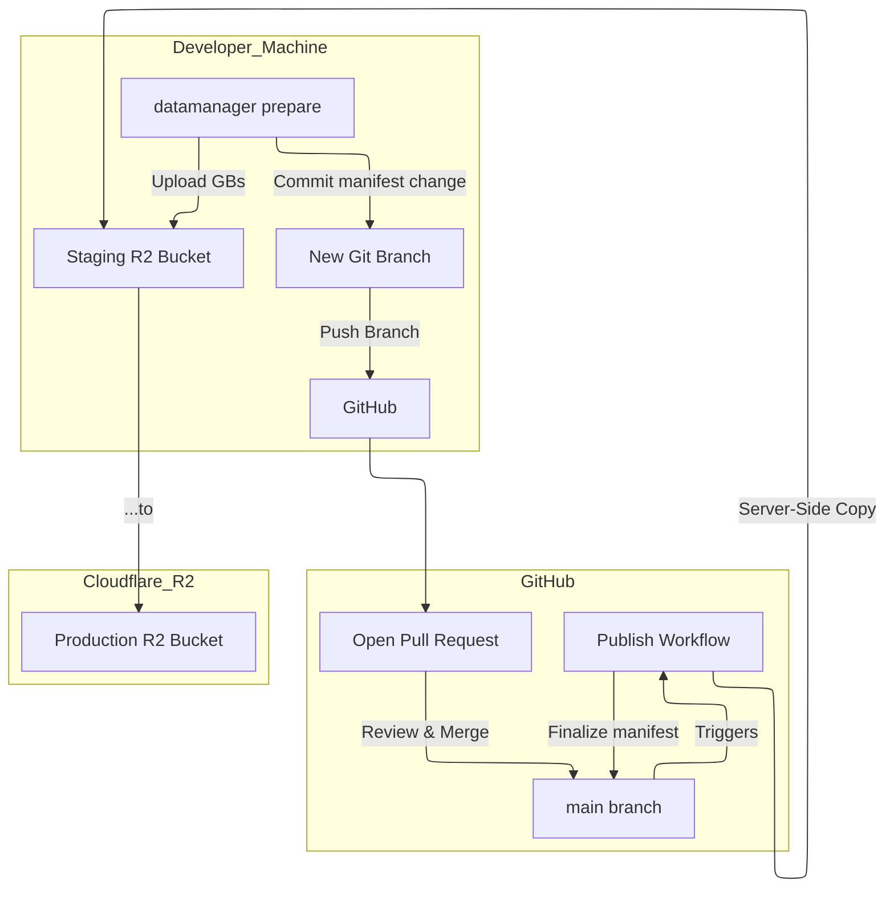
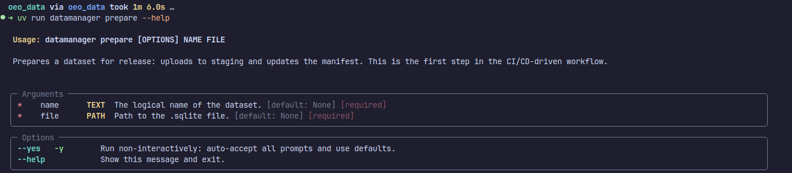
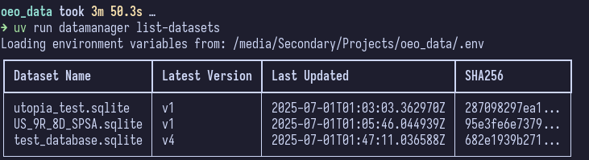
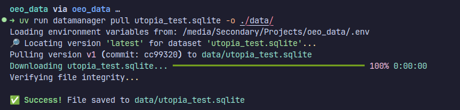

# OEO Data Management

[](https://codecov.io/gh/ParticularlyPythonicBS/oeo_data)
[](https://results.pre-commit.ci/latest/github/ParticularlyPythonicBS/oeo_data/main)
[](https://github.com/ParticularlyPythonicBS/oeo_data/actions/workflows/ci.yml)
[](https://github.com/ParticularlyPythonicBS/oeo_data/actions/workflows/publish.yml)
[](https://github.com/ParticularlyPythonicBS/oeo_data/actions/workflows/cleanup.yml)

This is the official repository for versioned input databases used by the Open Energy Outlook (OEO) initiative. It contains a command-line tool (datamanager) designed to manage these Temoa-compatible SQLite databases using a secure, auditable, and CI/CD-driven workflow.

## About the Data

The SQLite databases hosted here are designed to be used as inputs for [Temoa](https://github.com/TemoaProject/temoa), an open-source energy system optimization model.
This data is curated and maintained by the Open Energy Outlook (OEO) team. The goal is to provide a transparent, version-controlled, and publicly accessible set of data for energy systems modeling and analysis.

## The Core Concept

The system works by treating your Git repository as a source of truth for *metadata*. The final publication of data is handled by a trusted, automated GitHub Actions workflow after a Pull Request has been reviewed and merged.

This two-phase process ensures security and consistency:

1. **Prepare Phase (Local):** A developer prepares a new data version. The large file is uploaded to a temporary **staging bucket**, and a change to `manifest.json` is proposed.
2. **Publish Phase (Automated):** After the proposal is approved and merged into the `main` branch, a GitHub Action performs a secure, server-side copy from the staging bucket to the final **production bucket**, making the data live.



## Features

- **CI/CD-Driven Publishing:** Data publication is transactional and automated via GitHub Actions after a pull request is merged, preventing inconsistent states.
- **Enhanced Security:** Production credentials are never stored on developer machines; they are only used by the trusted GitHub Actions runner.
- **Interactive TUI:** Run `datamanager` with no arguments for a user-friendly, menu-driven interface.
- **Data Lifecycle Management:** A full suite of commands for rollback, deletion, and pruning, all gated by the same secure PR workflow.
- **Integrity Verification:** All downloaded files are automatically checked against their SHA256 hash from the manifest.
- **Credential Verification:** A detailed verify command reports read/write/delete permissions for both production and staging buckets.

## Prerequisites

- Python 3.12+
- Git
- `sqlite3` command-line tool
- An active Cloudflare account with **two** R2 buckets (one for production, one for staging).
- For the data in this repo, contact the OEO team for access to the R2 buckets.

## ⚙️ Setup and Installation

1. **Clone the Repository:**

    ```bash
    git clone git@github.com:ParticularlyPythonicBS/oeo_data.git
    cd oeo_data
    ```

2. **Install Dependencies:**
    This project uses and recommends `uv` for fast and reliable dependency management.

    ```bash
    # Create a virtual environment and install dependencies
    uv venv
    source .venv/bin/activate
    uv pip install -e .
    ```

    The `-e` flag installs the package in "editable" mode, so changes to the source code are immediately reflected.

3. **Configure Environment Variables:**
    The tool is configured using a `.env` file. Create one by copying the example:

    ```bash
    cp .env.example .env
    ```

    Now, edit the `.env` file with your Cloudflare R2 credentials. **This file should be in your `.gitignore` and never committed to the repository.**

    **`.env`**

    ```ini
    # Get these from your Cloudflare R2 dashboard
    R2_ACCOUNT_ID="your_cloudflare_account_id"
    R2_ACCESS_KEY_ID="your_r2_access_key"
    R2_SECRET_ACCESS_KEY="your_r2_secret_key"
    R2_PRODUCTION_BUCKET="your-production-bucket-name"
    R2_STAGING_BUCKET="your-staging-bucket-name"
    ```

4. **Verify Configuration:**
    Run the `verify` command to ensure your credentials and bucket access are correct.

    ```bash
    uv run datamanager verify
    ```

    

## 📖 The Data Publishing Workflow

All changes to the data—whether creating, updating, or deleting—follow a strict, safe, and reviewable Git-based workflow.

### Step 1: Create a New Branch

Always start by creating a new branch from the latest version of `main`. This isolates your changes.

```bash
git checkout main
git pull
git checkout -b feat/update-energy-data
```

### Step 2: Prepare Your Changes

Use the `datamanager` tool to stage your changes. The `prepare` command handles both creating new datasets and updating existing ones.

```bash
# This uploads the file to the staging bucket and updates manifest.json locally
uv run datamanager prepare energy-data.sqlite ./local-files/new-energy.sqlite
```

The tool will guide you through the process. For other maintenance tasks like `rollback` or `delete`, use the corresponding command.

### Step 3: Commit and Push

Commit the modified `manifest.json` file to your branch with a descriptive message. This message will become the official description for the new data version.

```bash
git add manifest.json
git commit -m "feat: Add 2025 energy data with new technology columns"
git push --set-upstream origin feat/update-energy-data
```

### Step 4: Open a Pull Request

Go to GitHub and open a pull request from your feature branch to `main`. The diff will clearly show the proposed changes to the manifest for your team to review.

### Step 5: Merge and Automate

Once the PR is reviewed, approved, and all status checks pass, merge it. The CI/CD pipeline takes over automatically:

- It copies the data from the staging bucket to the production bucket.
- It finalizes the `manifest.json` with the new commit hash and description.
- It pushes a final commit back to `main`.

The new data version is now live and available to all users via `datamanager pull`.

## 🚀 Usage

The primary workflow is now to **prepare** a dataset, then use standard Git practices to propose the change.

### Interactive TUI

For a guided experience, simply run the command with no arguments:

```bash
uv run datamanager
```

This will launch a menu where you can choose your desired action, including the new "Prepare a dataset for release" option.


### Command-Line Interface (CLI)

You can also use the command-line interface directly for specific tasks or for scripting purposes.


### Core Commands

#### `prepare`

Prepares a dataset for release by uploading it to the staging area and updating the manifest locally. This command intelligently handles both creating new datasets and updating existing ones.

**This is the first step of the new workflow.**

```bash
uv run datamanager prepare <dataset-name.sqlite> <path/to/local/file.sqlite>
```

After running `prepare`, follow the on-screen instructions:

1. `git add manifest.json`
2. `git commit -m "Your descriptive message"`
3. `git push`
4. Open a Pull Request in GitHub.



#### `list-datasets`

Lists all datasets currently tracked in `manifest.json`.

```bash
uv run datamanager list-datasets
```



#### `pull`

Downloads a dataset from the **production** R2 bucket and verifies its integrity.

```bash
# Pull the latest version
uv run datamanager pull user-profiles.sqlite

# Pull a specific version
uv run datamanager pull user-profiles.sqlite --version v2
```



### Maintenance Commands

#### `rollback`

Prepares a rollback to a previous stable version by creating a new version entry that points to the old data.

```bash
uv run datamanager rollback <dataset-name.sqlite> --to-version v1
```

#### `delete`

Prepares the **permanent** deletion of an entire dataset and all its versions. Requires strong confirmation.

```bash
uv run datamanager delete <dataset-name.sqlite>
```

#### `prune-versions`

Prepares the permanent deletion of old versions of a dataset, keeping a specified number of recent versions.

```bash
uv run datamanager prune-versions <dataset-name.sqlite> --keep 5
```

#### `verify`

Checks R2 credentials and reports granular read/write/delete permissions for both production and staging buckets.

```bash
uv run datamanager verify
```

## 🧑‍💻 Development and Testing

To contribute to the tool's development:

1. Install development dependencies using `uv pip install -e .[dev]`.
2. Run the test suite using `pytest`:

    ```bash
    uv run pytest
    ```

3. For code quality checks, run `pre-commit`:

    ```bash
    uv run pre-commit run --all-files
    ```
