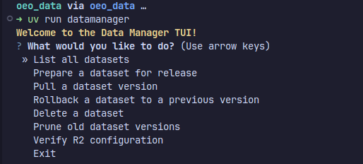

# Usage

The primary workflow is now to **prepare** a dataset, then use standard Git practices to propose the change.

## Interactive TUI

For a guided experience, simply run the command with no arguments:

```bash
uv run datamanager
```

This will launch a menu where you can choose your desired action, including the new "Prepare a dataset for release" option.



## Command-Line Interface (CLI)

You can also use the command-line interface directly for specific tasks or for scripting purposes.


## Core Commands

### `prepare`

Prepares a dataset for release by uploading it to the staging area and updating the manifest locally. This command intelligently handles both creating new datasets and updating existing ones.

**This is the first step of the new workflow.**

```bash
uv run datamanager prepare <dataset-name.sqlite> <path/to/local/file.sqlite>
```

After running `prepare`, follow the on-screen instructions:

1. `git add manifest.json`
2. `git commit -m "Your descriptive message"`
3. `git push`
4. Open a Pull Request in GitHub.


### `list-datasets`

Lists all datasets currently tracked in `manifest.json`.

```bash
uv run datamanager list-datasets
```


### `pull`

Downloads a dataset from the **production** R2 bucket and verifies its integrity.

```bash
# Pull the latest version
uv run datamanager pull user-profiles.sqlite

# Pull a specific version
uv run datamanager pull user-profiles.sqlite --version v2
```


## Maintenance Commands

### `rollback`

Prepares a rollback to a previous stable version by creating a new version entry that points to the old data.

```bash
uv run datamanager rollback <dataset-name.sqlite> --to-version v1
```

### `delete`

Prepares the **permanent** deletion of an entire dataset and all its versions. Requires strong confirmation.

```bash
uv run datamanager delete <dataset-name.sqlite>
```

### `prune-versions`

Prepares the permanent deletion of old versions of a dataset, keeping a specified number of recent versions.

```bash
uv run datamanager prune-versions <dataset-name.sqlite> --keep 5
```

### `verify`

Checks R2 credentials and reports granular read/write/delete permissions for both production and staging buckets.

```bash
uv run datamanager verify
```
